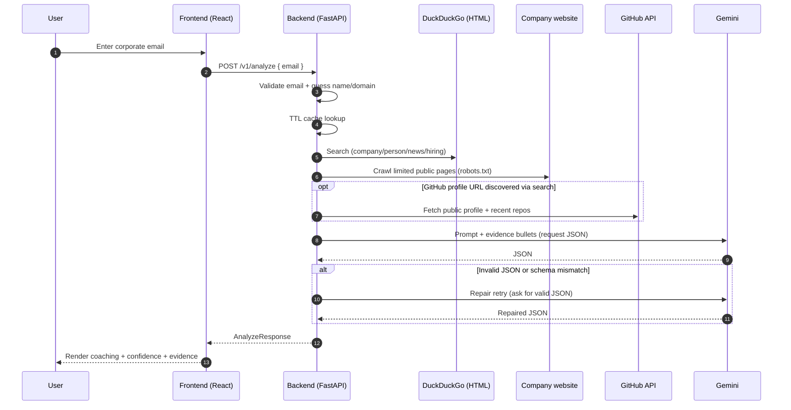

# Persona-Detection — Meeting Intelligence MVP (Recruiter Demo)

Persona-Detection is an end-to-end **Meeting Intelligence MVP**: given a **corporate email**, it uses **public web signals** (search snippets + a conservative company-site crawl) and an LLM to generate **probabilistic, evidence-backed** coaching for a recruiter-facing meeting.

This repo is intentionally **small, runnable, and demo-friendly**: one FastAPI endpoint, a React UI, and a pipeline that emphasizes **transparency (evidence panel)** and **uncertainty (confidence labels)**.

---

## Why this is interesting (for recruiters)
Most “persona enrichment” products either (a) rely on paid data providers, or (b) imply certainty from weak signals.

This MVP is different:
- **Public-data-only** by design (no paid enrichment APIs; no authenticated scraping).
- **Evidence-first UX**: the UI shows the exact snippets/URLs used.
- **Confidence labeling**: outputs are framed as inference (low/medium/high with rationale).
- **Pragmatic engineering**: caching + bounded crawling for stability in live demos.

---

## Live demo (what you’ll see)
Input: `"firstname.lastname@company.com"`

Output (JSON + UI):
- `one_minute_brief` (quick meeting prep)
- `company_profile` (products/services, hiring signals, public mentions)
- `study_of_person` (likely role focus & communication style)
- `questions_to_ask`, `email_openers`, `red_flags`
- `recommendations` (tone, do/don’t, connecting points, agenda)
- `confidence` + `evidence[]` (snippets + sources)
- optional: `github_profile` (only when a profile URL is discovered via public search)

---

## Architecture (high level)

> Mermaid diagrams render on GitHub and other Mermaid-enabled viewers. If you’re viewing this README somewhere that doesn’t render Mermaid, paste the diagram blocks into https://mermaid.live.

```mermaid
flowchart TD
  subgraph FE[Frontend]
    UI[React UI\n(Vite + TypeScript)]
  end

  subgraph BE[Backend]
    API[FastAPI\nPOST /v1/analyze]
    EP[Email parse + validation]
    CACHE[(TTL cache\n(in-memory))]
    COLLECT[Collect public signals]
    FUSE[Dedupe + rank evidence]
    LLM[Gemini\n(JSON mode)]
    GUARD[JSON guard\n+ repair retries]
    SCHEMA[Pydantic\nvalidation]
    RESP[AnalyzeResponse]

    API -. cache hit/miss .-> CACHE
    API --> EP --> COLLECT --> FUSE --> LLM --> GUARD --> SCHEMA --> RESP
  end

  subgraph SOURCES[Public sources]
    DDG[DuckDuckGo\nHTML search]
    CRAWL[Company site\nconservative crawl]
    GH[GitHub API\n(optional)]
  end

  UI -->|HTTP| API
  RESP --> UI

  COLLECT --> DDG
  COLLECT --> CRAWL
  COLLECT -. when GitHub URL discovered .-> GH
```

### Request sequence (what happens on `POST /v1/analyze`)



---

## Tech stack
### Backend
- **FastAPI** (`fastapi`, `uvicorn`) — lightweight API
- **Pydantic v2** — strict response schema validation
- **httpx** — outbound HTTP for search/scraping
- **google-genai** — Gemini client (configured for JSON output)
- **Custom crawling & extraction** — intentionally dependency-light for easy installs
- **In-memory TTL cache** — stabilizes demos and reduces repeated requests

### Frontend
- **React + TypeScript (Vite)**
- **Recharts** — evidence breakdown visualization
- Components focused on recruiter demo clarity: confidence meter, evidence panel, GitHub card, raw JSON viewer

---

## Safety / ethics constraints (explicitly enforced)
- **Corporate emails only** (blocks common free email domains)
- **Public web signals only**
  - No paid enrichment APIs
  - No LinkedIn login / no scraping behind auth
  - If LinkedIn appears, it’s only via *public search snippet + URL*
- **Robots.txt respected** for company-site crawling
- **No long-term storage** (MVP uses short TTL cache only)

See: `Docs/05_ethics_and_safety.md`

---

## Project layout
- `Backend/` — FastAPI app
  - `app/api/v1/analyze.py` — `POST /v1/analyze`
  - `app/intelligence/generate.py` — orchestration: evidence → Gemini → validation
  - `app/search/ddg.py` — DDG HTML search parsing
  - `app/scraping/company_site.py` + `app/scraping/robots.py` — conservative crawl
  - `app/enrichment/github.py` — GitHub public enrichment (optional)
  - `app/intelligence/json_guard.py` — strict JSON parsing + repair
  - `app/schemas/meeting_intel.py` — Pydantic response schema
- `Frontend/` — recruiter-focused UI
  - `src/api/client.ts` — API client + TS types
  - `src/components/*` — evidence/confidence visualization
- `Docs/` — runbook, architecture notes, safety

---

## Quickstart

### Backend

```bash
cd Persona-Detection/Backend
python -m venv .venv
# Windows: .venv\Scripts\activate
# macOS/Linux: source .venv/bin/activate
pip install -r requirements.txt

# Configure Gemini
copy .env.example .env  # Windows PowerShell: Copy-Item .env.example .env
# edit .env and set GEMINI_API_KEY

uvicorn app.main:app --reload --port 8000
```

### Frontend

```bash
cd Persona-Detection/Frontend
npm install
# Create .env with VITE_API_BASE_URL=http://localhost:8000
npm run dev
```

Open the Vite URL (typically `http://localhost:5173`).

---

## Competitive landscape (what others often do)
In the market, “persona / lead intelligence” tools tend to fall into a few patterns:
1. **Data-provider aggregators**: rely on paid enrichment APIs and proprietary datasets.
2. **Browser-scrape approaches**: scrape social sites (often behind auth), which raises fragility and compliance risk.
3. **LLM-only guesswork**: produce fluent output without traceable evidence.

This MVP demonstrates a safer, more transparent alternative:
- **Evidence-traceable** outputs
- **Confidence-aware** synthesis
- **Public-data-only** collection

---

## Future possibilities (ways to impress further)
These are realistic extensions that keep the same philosophy (public + evidence + confidence):

### Product / UX
- **Streaming progress** (SSE/WebSocket): show stages like “Searching…”, “Crawling…”, “Generating…” with real-time updates.
- **Evidence highlighting**: show which evidence supported each claim (claim-to-citation mapping).
- **Exportables**: “meeting brief” PDF, calendar-notes snippet, ATS/CRM note template.

### Data & retrieval
- **Better HTML parsing** (e.g., BeautifulSoup) and stronger dedupe/cluster logic.
- **RAG-style chunking**: index crawled text into chunks and cite specific passages.
- **Additional public sources** (policy-aware):
  - press releases/news RSS feeds
  - public job postings (structured extraction)
  - conference talks / podcasts / blogs

### Modeling & reliability
- **Deterministic scoring**: compute `company_confidence` vs `person_confidence` from evidence volume/quality.
- **Guardrails**: factuality checks (e.g., “must cite at least one URL for company claims”).
- **Offline eval harness**: replay a set of test emails/domains and measure schema validity + stability.

### Production hardening
- Persistent cache (Redis) + rate limiting
- Observability (structured logs, tracing)
- Background jobs for crawling (Celery/RQ) with resumable pipelines

---

## Docs
Start with:
- `Docs/00_overview.md`
- `Docs/04_demo_runbook.md`
- `Docs/06_backend_how_it_works.md`
- `Docs/05_ethics_and_safety.md`
